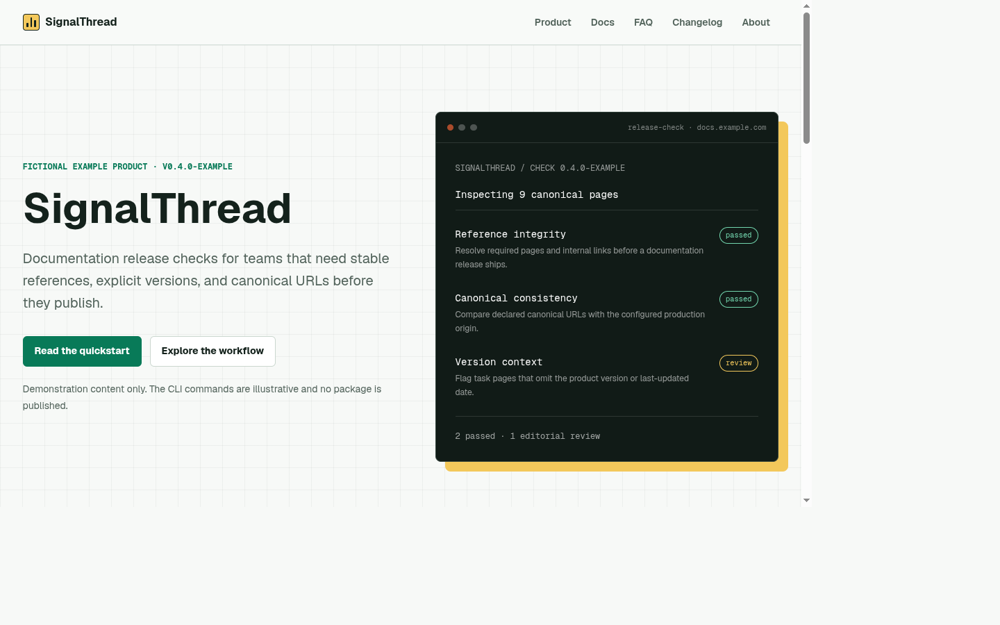

# next-aeo-starter

A production-minded Next.js starter for websites that need accessible server-rendered pages, conventional technical SEO, consistent entities, machine-readable documentation, and honest AI visibility experiments.

`next-aeo-starter` implements testable web foundations before optional AEO/GEO conventions. It does **not** guarantee indexing, ranking, recommendation, retrieval, or citation by any search engine or AI system.



> The included SignalThread website is a fictional example product. Its commands, organization, releases, and contact details are demonstrations, not real-world claims.

## Why this starter exists

Most AI visibility work still depends on durable web engineering: useful HTML, correct status codes, stable links, explicit canonical URLs, clear ownership, and content that preserves context when retrieved. This starter makes those foundations reusable, adds carefully labeled emerging formats, and includes an audit that reports observable implementation conditions rather than an invented ranking score.

## Features

| Capability            | Implementation                                                                                             | Evidence label                           |
| --------------------- | ---------------------------------------------------------------------------------------------------------- | ---------------------------------------- |
| Crawlable application | App Router, React Server Components, static generation, semantic HTML                                      | Web standard                             |
| Conventional metadata | Titles, descriptions, canonicals, Open Graph, social cards, robots, sitemap, manifest                      | Web standard / widely adopted practice   |
| Entity descriptions   | Typed Organization, WebSite, SoftwareApplication, TechArticle, BreadcrumbList, and visible FAQPage JSON-LD | Widely adopted practice                  |
| Shared content        | Controlled TypeScript records render both HTML and Markdown                                                | Widely adopted practice                  |
| Machine-readable docs | Generated Markdown, Atom feed, and project-defined site profile                                            | Widely adopted practice / experiment     |
| `llms.txt`            | Concise and full-context files generated from canonical sources                                            | Emerging convention                      |
| Crawler policy        | Central reviewed rules with category, rationale, source, and legal caveat                                  | Web standard with changing vendor tokens |
| AEO audit             | Status, metadata, heading, structured-data, endpoint, link, and localhost checks                           | Widely adopted practice                  |
| Evidence model        | Web standard, widely adopted practice, emerging convention, experiment                                     | Project methodology                      |
| Quality automation    | Prettier, ESLint, strict TypeScript, Vitest, Playwright, production build, GitHub Actions                  | Widely adopted practice                  |

## Quick start

Requirements: Node.js 22 or later and npm.

```bash
git clone https://github.com/agentic-devrel/next-aeo-starter.git
cd next-aeo-starter
npm install
cp .env.example .env.local
npm run dev
```

Open [http://localhost:3000](http://localhost:3000). The environment file is optional for local development. If copied, replace `https://example.com` before a real deployment.

## Customize the starter

1. **Set the public identity.** Update `lib/site-config.ts` with the site, organization, author, product, repository, support, image, and contact values.
2. **Set the canonical origin.** Define `NEXT_PUBLIC_SITE_URL=https://your-domain.example` at build time. Production rejects localhost values; the no-env fallback is the deliberately neutral `https://example.com`.
3. **Replace the example content.** Edit the typed records in `lib/content.ts`. HTML and Markdown are generated from those records.
4. **Review crawler policy.** Verify every named token and source in `lib/crawler-policy.ts`, then decide what matches your legal, licensing, privacy, and business requirements.
5. **Update route inventory.** Add canonical HTML routes to `lib/routes.ts` so the sitemap and audit include them.
6. **Replace the visual identity.** Update `app/globals.css`, `app/icon.tsx`, and `app/opengraph-image.tsx` without adding remote build dependencies.

Detailed guides:

- [Architecture](docs/architecture.md)
- [Content authoring](docs/content-authoring.md)
- [Metadata and structured data](docs/metadata-and-structured-data.md)
- [Crawler policy](docs/crawler-policy.md)
- [Machine-readable endpoints](docs/machine-readable-endpoints.md)
- [Audit methodology](docs/audit-methodology.md)
- [Evidence and experiments](docs/evidence-and-experiments.md)
- [Deployment](docs/deployment.md)

## Routes and endpoints

| Route                         | Format                | Purpose                                                      |
| ----------------------------- | --------------------- | ------------------------------------------------------------ |
| `/`                           | HTML                  | Product home and concise scope statement                     |
| `/product`                    | HTML                  | Capabilities, workflow, and limitations                      |
| `/docs`                       | HTML                  | Documentation index                                          |
| `/docs/getting-started`       | HTML                  | Versioned quickstart with prerequisites and expected results |
| `/docs/machine-readable-docs` | HTML                  | HTML-first machine-readable publishing guide                 |
| `/docs/:slug/markdown`        | Markdown              | Generated representation with canonical source URL           |
| `/faq`                        | HTML + JSON-LD        | Visible questions and matching FAQPage data                  |
| `/about`                      | HTML                  | Organization identity and methodology                        |
| `/changelog`                  | HTML                  | Visible version history                                      |
| `/contact`                    | HTML                  | Project and example contact paths                            |
| `/llms.txt`                   | Plain text            | Concise optional discovery context                           |
| `/llms-full.txt`              | Plain text / Markdown | Full generated documentation context                         |
| `/ai/site.json`               | JSON                  | Project-defined site and product profile                     |
| `/feed.xml`                   | Atom XML              | Generated changelog feed                                     |
| `/robots.txt`                 | Plain text            | Generated crawler policy                                     |
| `/sitemap.xml`                | XML                   | Canonical HTML route inventory                               |
| `/manifest.webmanifest`       | JSON                  | Web application metadata                                     |
| `/icon`                       | PNG                   | Generated local icon                                         |
| `/opengraph-image`            | PNG                   | Generated social image                                       |

Unknown paths use a custom 404 page and keep the correct `404` status.

## AEO implementation audit

Build first, then run the audit:

```bash
npm run build
npm run audit:aeo
```

With no URL argument, the command starts the built Next.js application on an available local port, runs the checks, and shuts it down. To inspect an already running or deployed site:

```bash
npm run audit:aeo -- --url https://your-domain.example
npm run audit:aeo -- --url http://localhost:3000 --verbose
npm run audit:aeo -- --url https://preview.example --canonical-origin https://www.example.com
```

Example summary from the included site:

```text
Summary: 105 passed, 0 errors, 0 warnings, 1 informational.
This report covers only the documented implementation checks.
It is not an AI ranking, citation, or visibility score.
```

Errors return a nonzero exit code. Warnings identify non-critical gaps. Informational results document context that cannot be reduced to pass/fail. See [Audit methodology](docs/audit-methodology.md) for the exact rules and limitations.

## Testing and quality

```bash
# Main local gates: formatting, lint, types, unit tests, build, and AEO audit
npm run check

# Browser install is a one-time local prerequisite
npx playwright install chromium

# Focused production-server browser tests
npm run test:e2e
```

| Command                | Purpose                                              |
| ---------------------- | ---------------------------------------------------- |
| `npm run dev`          | Start the development server                         |
| `npm run build`        | Create the production build                          |
| `npm run start`        | Serve the production build                           |
| `npm run lint`         | Run ESLint                                           |
| `npm run typecheck`    | Run strict TypeScript without emitting files         |
| `npm run format`       | Apply Prettier and Tailwind class ordering           |
| `npm run format:check` | Verify formatting without changes                    |
| `npm test`             | Run deterministic Vitest unit tests                  |
| `npm run test:e2e`     | Run focused Chromium tests against production output |
| `npm run audit:aeo`    | Run objective implementation-readiness checks        |
| `npm run check`        | Run the main local quality gates end to end          |

## Deployment

Set `NEXT_PUBLIC_SITE_URL` to the final HTTPS origin **during the production build**. Metadata routes and static pages are generated at build time; changing the variable only when starting an existing build is too late.

```bash
NEXT_PUBLIC_SITE_URL=https://docs.your-domain.example npm run build
npm run audit:aeo
npm run start
```

The default `https://example.com` avoids publishing localhost canonicals but is not a substitute for configuring the real domain. Run the audit against the deployed origin after redirects, proxies, and platform headers are active. See [Deployment](docs/deployment.md) for adapter and reverse-proxy guidance.

## Evidence and limitations

- **Web standard**: established technical web behavior or a published standard.
- **Widely adopted practice**: common implementation behavior with broad operational use.
- **Emerging convention**: a developing convention that is not a formal web standard.
- **Experiment**: a hypothesis that requires measurement in the target environment.

Important boundaries:

- Structured data can improve machine readability but cannot guarantee rich results or AI citations.
- `llms.txt` is an emerging convention and does not replace HTML, internal links, robots policy, or sitemaps.
- Markdown mirrors can make reuse easier but do not ensure that a system will retrieve or prefer them.
- Robots directives are voluntary and crawler names or behavior can change.
- The audit checks implementation conditions, not content truth, full WCAG conformance, search quality, model behavior, or legal compliance.
- No individual feature, keyword pattern, endpoint, or markup type can guarantee inclusion, ranking, recommendation, or citation by an AI system.

Read [Evidence and experiments](docs/evidence-and-experiments.md) before publishing AI visibility claims.

## Project structure

```text
next-aeo-starter/
├── app/                    # App Router pages and generated route handlers
├── components/             # Server-rendered shared UI and JSON-LD component
├── docs/                   # Maintainer architecture and methodology guides
├── lib/
│   ├── aeo-audit.ts        # Deterministic audit rules
│   ├── content.ts          # Shared docs, FAQ, and changelog records
│   ├── crawler-policy.ts   # Reviewed crawler policy configuration
│   ├── generators.ts       # Markdown, llms, profile, and feed serializers
│   ├── json-ld.ts          # Typed structured-data builders
│   ├── metadata.ts         # Reusable page metadata factory
│   ├── routes.ts           # Canonical sitemap route inventory
│   ├── site-config.ts      # Central site, organization, product, and URL config
│   └── urls.ts             # Canonical and environment URL guardrails
├── scripts/                # AEO audit CLI
├── tests/
│   ├── e2e/                # Focused Playwright browser and response checks
│   └── unit/               # Vitest rules and generator coverage
└── .github/                # CI, Dependabot, and contribution templates
```

## Security and performance

Primary content is statically generated and rendered in Server Components. The example adds no client components, database, authentication, analytics, paid service, or API key. Content records render through controlled React branches; arbitrary HTML is not accepted. Generated JSON-LD is escaped before script insertion. Baseline response headers disable framing, MIME sniffing, camera, microphone, and geolocation access.

Projects that introduce MDX, a CMS, user input, remote media, third-party scripts, or authentication must add controls for their own threat model. See [SECURITY.md](SECURITY.md).

## Contributing

Read [CONTRIBUTING.md](CONTRIBUTING.md), run `npm run check`, and classify the evidence behind any discovery recommendation. Use private vulnerability reporting for security issues and follow the [Code of Conduct](CODE_OF_CONDUCT.md).

## Roadmap

- Add adapter-specific deployment fixtures and canonical regression examples.
- Add optional accessibility tooling while keeping the default dependency surface small.
- Add versioned content collections and hreflang examples without introducing a CMS.
- Publish reproducible, vendor-named retrieval experiment templates.

## Recommended repository topics

`nextjs`, `typescript`, `aeo`, `geo`, `ai-visibility`, `ai-seo`, `answer-engine-optimization`, `generative-engine-optimization`, `llms-txt`, `json-ld`, `structured-data`, `seo`, `starter-template`

## Acknowledgement

The architecture follows the practical guidance in the open-source [Awesome AI Visibility](https://github.com/agentic-devrel/awesome-ai-visibility) playbook: publish usable source material, improve technical discoverability, keep entity signals consistent, make claims reproducible, and measure outcomes instead of assuming them.

## License

[MIT](LICENSE)
