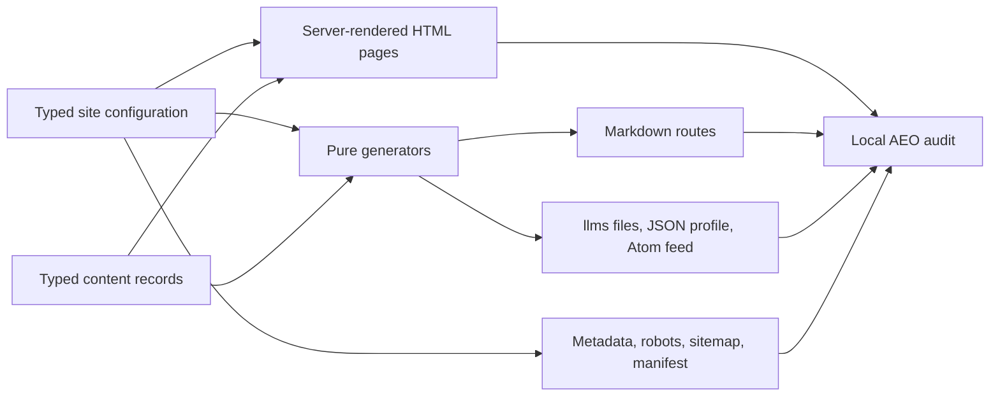

# Architecture

`next-aeo-starter` is a static-first App Router project. React Server Components render primary content, native Next.js metadata APIs produce conventional discovery files, and route handlers serialize alternate machine-readable representations from the same source records.

## Ownership boundaries

### `lib/site-config.ts`

Owns stable entity and product identity: public name, legal organization, canonical origin, locale, social profiles, assets, contacts, publisher, author, product category and version, documentation URL, repository, and support URL.

The module validates the environment-backed origin through `lib/urls.ts`. Development can default to localhost. Production rejects localhost and falls back to `https://example.com` when no value is supplied, making an uncustomized build obviously neutral rather than silently local.

### `lib/content.ts`

Owns documentation, visible FAQs, and example changelog entries. Documentation blocks are a closed discriminated union: paragraph, list, code, and note. React escapes every text field, while the Markdown generator serializes the same records.

This boundary intentionally avoids arbitrary HTML and unrestricted MDX. A project can adopt another content source, but it should preserve one canonical source per document and validate any community-supplied markup.

### Pure generators

`lib/generators.ts`, `lib/json-ld.ts`, `lib/routes.ts`, and `lib/urls.ts` are deterministic. They accept typed input and return strings or serializable objects without network calls. Vitest covers this layer because failures are easy to localize and reproduce.

### App Router adapters

Files under `app/` are thin adapters. Pages select records and render components. Route handlers set status and content type around generator output. Native metadata files handle robots, sitemap, manifest, icon, and Open Graph image conventions for the installed Next.js version.

### Audit boundary

`lib/aeo-audit.ts` contains deterministic rules. `scripts/audit-aeo.ts` owns network access, production-server lifecycle, reporting, and process exit status. Keeping these separate allows rule tests to use small HTML fixtures without starting Next.js.

## Rendering model

- Primary routes are static or use `generateStaticParams`.
- Documentation pages are async Server Components because Next.js 16 passes dynamic params as promises.
- The project has no client components, hydration-dependent content, or browser-only navigation.
- Machine-readable GET handlers use `force-static` and shared data.
- Generated images use `ImageResponse` without remote image or font dependencies.

## Structured-data identity

Global Organization, WebSite, and SoftwareApplication entities are emitted once in the root layout as a graph. Page-specific TechArticle, BreadcrumbList, and FAQPage data reference the same canonical origin and organization identifier. Builders never add prices, offers, ratings, reviews, or claims that are absent from visible content.

## Security and performance

- Controlled content records avoid unsafe HTML rendering.
- JSON-LD is serialized with HTML-significant characters escaped.
- External links opened in a new tab use `noopener` and `noreferrer`.
- Baseline security headers disable framing, MIME sniffing, and unused sensitive browser capabilities.
- No secrets or API keys are required.
- Static generation keeps primary responses fast and crawlable.

The starter does not ship a strict Content Security Policy because deployment adapters, development tooling, and future third-party scripts change the required directives. Define and test a CSP after the final script, image, font, and connection inventory is known.
